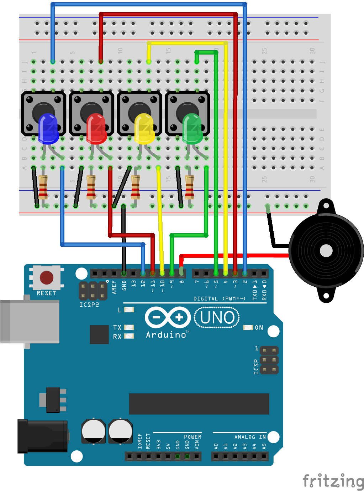

# ng2-simon

A Universal Simon game written in Angular 2.

It runs on the web browser, on Arduino and also on the Raspberry PI using [angular2-iot](https://github.com/urish/angular2-iot).

➡ [Learn how to works and how you can build your own version](https://medium.com/@urish/building-simon-with-angular2-iot-fceb78bb18e5)

## Live Demo (browser)

[Go to the online version](https://urish.github.io/ng2-simon/)

## Running in a Web Browser

    npm install
    npm start

Then go to [http://localhost:3000](http://localhost:3000) in your browser.

## Running on Raspberry Pi

### Hardware Assembly

1. Connect 4 push-buttons, one button between each of pins GPIO-13, GPIO-26, GPIO-16, GPIO-21 and the ground
2. Connect 4 colored LEDs, one LED between each of pins GPIO-6, GPIO-19, GPIO-12, GPIO-20 and the ground. It is also recommended to add a 100ohm current limiting resistor in series with each LED.
3. Connect a speaker to the Raspberry PI audio jack
4. Optionally, connect a [Serial 7-Segment Display](https://www.sparkfun.com/products/11442) to the I2C pins of the Raspberry Pi: connect GPIO-2 to SDL and GPIO-3 to SCL

### Running the game

Run the following command on the Raspberry pi terminal / console:

1. Make sure you have the `sox` and `mpg123` packages installed: `sudo apt-get install sox mpg123`
2. Build the project using `npm run build:iot`
3. Run it using `sudo npm run iot`

## Running on Arduino

### Hardware Assembly

1. Connect 4 push-buttons, one button between each of Arduino pins 2, 3, 4, 5 and the ground
2. Connect 4 colored LEDs, one LED between each of Arduino pins 9, 10, 11, 12 and a current limiting resistor connected to the ground. 220ohm is a good value for the resistor.
3. Optionally, connect a small speaker between pin 8 and the ground

### Running the game

1. Connect the Arduino board to your computer
2. Upload the [StandardFirmata firmware](https://github.com/firmata/arduino) firmware to your Arduino board
3. Build the project using `npm run build:iot`
4. Run it using `npm run iot`
